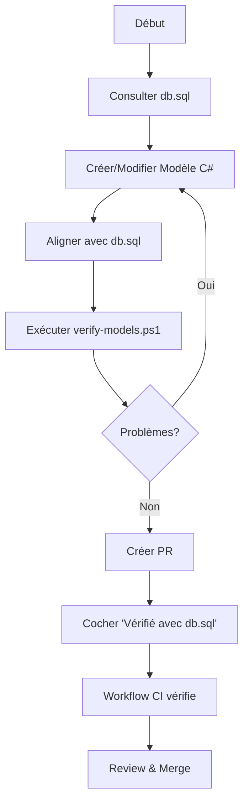

# Module Discipline - Cohérence avec db.sql

## 📋 Décision Importante

**db.sql est la source de vérité unique pour la structure des tables du module Discipline.**

Toute modification de code (Models, Services, Controllers, DTOs, migrations, triggers) doit être vérifiée par rapport à db.sql avant publication.

## 🎯 Objectif

Cette décision vise à :
- ✅ Garantir la cohérence entre le code C# et la structure de la base de données
- ✅ Éviter les écarts qui ont été identifiés (modèles simplifiés, enums dispersés, etc.)
- ✅ Faciliter la maintenance et le debugging
- ✅ Améliorer la qualité du code et réduire les bugs

## 🚀 Quick Start

### Pour les Développeurs

Avant de créer ou modifier un modèle/table du module Discipline :

1. **Consultez db.sql** pour voir la structure exacte
2. **Alignez votre code** avec les noms de colonnes, types et contraintes
3. **Exécutez le script de vérification** : `.\scripts\verify-models.ps1`
4. **Cochez la case** "Vérifié avec db.sql" dans votre PR

### Tables Concernées

- CouncilMeeting (Réunions du conseil de discipline)
- ConductScore (Notes de conduite)
- AppliedSanction (Sanctions appliquées)
- SanctionType (Types de sanctions)
- Et toutes les tables liées au module Discipline

## 📚 Documentation

- **[Guide de Vérification Complet](.github/DB_VERIFICATION_GUIDE.md)** - Documentation détaillée
- **[Template de PR](.github/PULL_REQUEST_TEMPLATE.md)** - Checklist obligatoire
- **[Script de Vérification](scripts/verify-models.ps1)** - Outil PowerShell

## 🔧 Outils Disponibles

### Script de Vérification PowerShell

```powershell
# Depuis la racine du projet
.\scripts\verify-models.ps1
```

Ce script :
- ✅ Vérifie que db.sql existe
- ✅ Liste les tables du module Discipline
- ✅ Extrait les colonnes de chaque table
- ✅ Cherche les modèles C# correspondants
- ✅ Signale les incohérences potentielles

### Workflow GitHub Actions

Un workflow automatique vérifie chaque PR et :
- 🔍 Détecte les modifications du module Discipline
- 💬 Poste un rappel dans les commentaires
- 📝 Fournit une checklist de vérification

## ✅ Checklist PR (Obligatoire)

Lors de la création d'une PR qui touche au module Discipline, vous **DEVEZ** :

- [ ] Consulter db.sql avant toute modification
- [ ] Vérifier les noms de colonnes exacts
- [ ] Vérifier les types de données
- [ ] Vérifier les contraintes (NOT NULL, UNIQUE, etc.)
- [ ] Vérifier les relations et foreign keys
- [ ] Exécuter le script `verify-models.ps1`
- [ ] **Cocher "Vérifié avec db.sql"** dans le template de PR

## 🔄 Workflow de Développement



## 📖 Exemples

### ✅ Bon Exemple

```csharp
// db.sql: 
// CREATE TABLE CouncilMeeting (
//   CouncilMeetingID int(11) NOT NULL,
//   MeetingTitle varchar(200) NOT NULL,
//   MeetingDate date NOT NULL,
//   ...

public class CouncilMeeting
{
    [Required]
    public int CouncilMeetingID { get; set; }
    
    [Required]
    [StringLength(200)]
    public string MeetingTitle { get; set; }
    
    [Required]
    public DateTime MeetingDate { get; set; }
}
```

### ❌ Mauvais Exemple

```csharp
// Ne correspond PAS à db.sql
public class CouncilMeeting
{
    public int Id { get; set; }  // ❌ Devrait être CouncilMeetingID
    public string Name { get; set; }  // ❌ Devrait être MeetingTitle
    // ❌ Manque MeetingDate
}
```

## 🛠️ Services en Refactorisation

Les services suivants sont planifiés pour mise en conformité :
- [ ] SanctionTypeService
- [ ] CouncilMeetingService  
- [ ] ConductScoreService (migration depuis stored procedures)

## 📞 Support

Questions ? Problèmes ?
1. Consultez le [Guide de Vérification](.github/DB_VERIFICATION_GUIDE.md)
2. Vérifiez les PRs récentes pour des exemples
3. Contactez l'équipe de développement

---

**Technologie:** .NET Framework 4.7.2  
**Dernière mise à jour:** Janvier 2026
